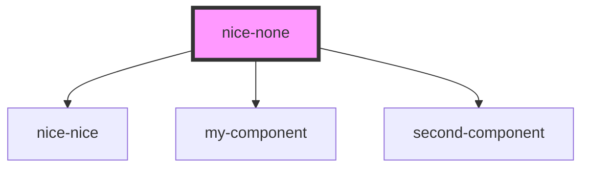

# nice-none

<!-- Auto Generated Below -->

## Dependencies

### Depends on

- [nice-nice](../nice-nice)
- [my-component](../my-component)
- [second-component](../second-component)

### Graph

----------------------------------------------

*Built with [StencilJS](https://stenciljs.com/)*
