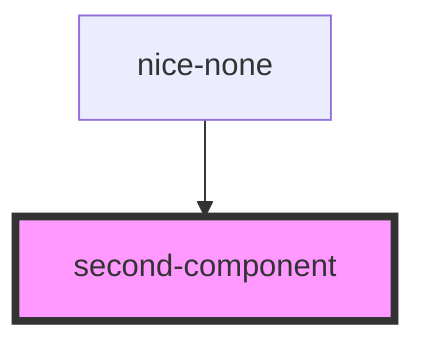

# second-component

<!-- Auto Generated Below -->

## Dependencies

### Used by

 - [nice-none](../nice-none)

### Graph

----------------------------------------------

*Built with [StencilJS](https://stenciljs.com/)*
